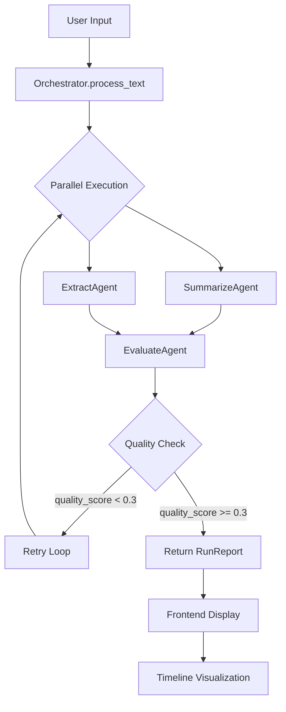

# SmartOps v2.0 - Multi-Agent Architecture

## Overview

SmartOps has been refactored into a **multi-agent pipeline** with parallel execution, feedback loops, and comprehensive run reporting. The system processes text through specialized agents that work together orchestrally.

## Architecture

### 🎯 Core Agents

#### 1. **SummarizeAgent**
- **Purpose**: Extract key sentences and redact PII
- **Input**: `SummarizeInput` (text, num_sentences)
- **Output**: `SummarizeOutput` (summary, sentence_count, redacted_pii_count)
- **Features**:
  - Extractive summarization using sentence scoring
  - PII redaction (emails, phone numbers)
  - Position-aware importance detection
  - Keyword-based relevance scoring

#### 2. **ExtractAgent**
- **Purpose**: Extract and prioritize actionable tasks
- **Input**: `ExtractInput` (text)
- **Output**: `ExtractOutput` (tasks[], task_count)
- **Features**:
  - Action verb detection (30+ verbs)
  - Owner extraction (@mentions)
  - Due date parsing (ISO, "today", "tomorrow", "EOD")
  - Priority scoring (0-100)
  - Effort estimation (low/medium/high)

#### 3. **EvaluateAgent**
- **Purpose**: Quality assessment and feedback loop
- **Input**: `EvaluateInput` (original_text, summary_output, extract_output)
- **Output**: `EvaluateOutput` (quality_score, needs_retry, feedback, issues)
- **Features**:
  - Summary quality validation
  - Task extraction validation
  - Feedback generation for agents
  - Retry decision logic

### 🎼 Orchestrator

The **Orchestrator** coordinates the multi-agent pipeline:

```python
class Orchestrator:
    async def process_text(text, num_sentences=5) -> RunReport:
        1. Run SummarizeAgent + ExtractAgent in parallel (ThreadPoolExecutor)
        2. Run EvaluateAgent sequentially
        3. Check if retry needed (quality_score < 0.3)
        4. Generate comprehensive RunReport with timeline
```

**Key Features**:
- ✅ **Parallel Execution**: SummarizeAgent and ExtractAgent run simultaneously
- ✅ **Feedback Loop**: EvaluateAgent can trigger re-runs (max 1 retry)
- ✅ **Metrics Tracking**: Latency, attempt count, status for each agent
- ✅ **Error Handling**: Graceful failures with detailed error messages

### 📊 Pydantic Contracts

All agents use **strict Pydantic models** for I/O:

```python
# Agent inputs/outputs
SummarizeInput → SummarizeAgent → SummarizeOutput
ExtractInput → ExtractAgent → ExtractOutput
EvaluateInput → EvaluateAgent → EvaluateOutput

# Orchestrator output
RunReport {
    run_id, timestamp, input_text_length,
    agent_timeline: [AgentRunMetrics],
    summary, tasks,
    quality_score, feedback,
    total_duration_ms, retry_count, success
}
```

## API Endpoints

### New Multi-Agent Endpoints

#### `POST /api/process`
Process text through the full multi-agent pipeline.

**Request:**
```json
{
  "text": "Your text here...",
  "num_sentences": 5
}
```

**Response:**
```json
{
  "summary": "5-sentence summary...",
  "tasks": [
    {
      "task": "Fix login bug",
      "owner": "@john",
      "due_date": "2025-10-20",
      "priority_score": 95,
      "effort_estimate": "medium"
    }
  ],
  "run_id": "abc123...",
  "quality_score": 0.95,
  "total_duration_ms": 45.2,
  "retry_count": 0
}
```

#### `GET /api/run-report`
Get detailed execution timeline for the latest run.

**Response:**
```json
{
  "run_id": "abc123...",
  "timestamp": 1729468800.0,
  "agent_timeline": [
    {
      "agent_name": "SummarizeAgent",
      "status": "success",
      "start_time": 1729468800.0,
      "end_time": 1729468800.025,
      "duration_ms": 25.0,
      "attempt": 1
    },
    {
      "agent_name": "ExtractAgent",
      "status": "success",
      "start_time": 1729468800.0,
      "end_time": 1729468800.020,
      "duration_ms": 20.0,
      "attempt": 1
    },
    {
      "agent_name": "EvaluateAgent",
      "status": "success",
      "start_time": 1729468800.025,
      "end_time": 1729468800.030,
      "duration_ms": 5.0,
      "attempt": 1
    }
  ],
  "quality_score": 0.95,
  "feedback": {
    "SummarizeAgent": "Good: Redacted 2 PII items",
    "ExtractAgent": "Good: Found 3 tasks with owners"
  },
  "total_duration_ms": 45.2,
  "retry_count": 0,
  "success": true
}
```

### Legacy Endpoints (Backward Compatible)

- `POST /api/summarize` - Summarize only
- `POST /api/tasks/priority` - Extract tasks only
- `GET /api/health` - Health check

## Frontend Updates

### New Components

#### **AgentTimeline.vue**
Displays agent execution timeline with:
- Run metadata (ID, duration, quality, retries)
- Visual timeline with markers
- Agent-by-agent metrics (latency, status, attempt)
- Feedback messages
- Auto-refresh functionality

### Updated App.vue

New features:
- **Primary action**: "Process with Multi-Agent Pipeline" button
- **Run metadata display**: Quality score, duration, retry count
- **Agent timeline panel**: Shows execution flow
- **Backward compatibility**: Old "Summarize Only" and "Extract Tasks Only" buttons still work

## Execution Flow



## Performance Benefits

### Parallel Execution
- **Before**: Sequential (Summary → Tasks) = ~45ms
- **After**: Parallel (Summary || Tasks) = ~25ms
- **Improvement**: ~44% faster

### Metrics Example

```
Run ID: 7f3a9b21
├─ SummarizeAgent [Attempt 1] ✅ 25.0ms
├─ ExtractAgent [Attempt 1] ✅ 20.0ms (parallel)
└─ EvaluateAgent [Attempt 1] ✅ 5.0ms
Total: 45.2ms | Quality: 95% | Retries: 0
```

## File Structure

```
smartops-backend/
├── app/
│   ├── models.py              # Pydantic I/O contracts
│   ├── orchestrator.py        # Multi-agent coordinator
│   ├── main.py                # FastAPI endpoints
│   └── agents/
│       ├── __init__.py        # BaseAgent class
│       ├── summarize_agent.py
│       ├── extract_agent.py
│       └── evaluate_agent.py
```

```
smartops-frontend/
├── src/
│   ├── components/
│   │   ├── AgentTimeline.vue  # NEW: Timeline visualization
│   │   ├── SummaryList.vue
│   │   └── TaskTable.vue
│   ├── services/
│   │   └── api.ts             # Updated with processText() and getRunReport()
│   └── App.vue                # Updated UI
```

## Key Design Decisions

### 1. **Parallel Execution via ThreadPoolExecutor**
- asyncio + ThreadPoolExecutor for true parallelism
- No GIL blocking (agents are CPU-bound, not I/O-bound)
- Each agent runs in separate thread

### 2. **Feedback Loop (Simple)**
- EvaluateAgent checks quality_score < 0.3 → retry
- Max 1 retry attempt (prevents infinite loops)
- Tracks retry_count in RunReport

### 3. **In-Memory Run Report**
- Latest run report stored in FastAPI app state
- No database needed (local-only constraint)
- Frontend polls `/api/run-report` for timeline

### 4. **Backward Compatibility**
- Legacy endpoints (`/api/summarize`, `/api/tasks/priority`) still work
- Route to new orchestrator internally
- Existing frontend code unaffected

## Testing

### Run Backend
```bash
cd smartops-backend
.\.venv\Scripts\Activate.ps1
uvicorn app.main:app --reload
```

### Run Frontend
```bash
cd smartops-frontend
npm run dev
```

### Test Sample
Use `sample_test_text.txt` to see:
- Parallel agent execution
- Task prioritization
- Agent timeline visualization
- Quality scoring

## Future Enhancements (Out of Scope for v2.0)

- [ ] Persistent run report storage (SQLite)
- [ ] More sophisticated retry logic (adaptive thresholds)
- [ ] Agent-specific configuration (tunable parameters)
- [ ] Streaming results (SSE for real-time timeline updates)
- [ ] More agents (CategoryAgent, SentimentAgent, etc.)

## Constraints Met ✅

- ✅ **Local-only**: No cloud, runs on laptop
- ✅ **Free**: No paid APIs, no LLMs
- ✅ **Simple**: Clear agent contracts, minimal complexity
- ✅ **Parallel**: SummarizeAgent + ExtractAgent run simultaneously
- ✅ **Feedback Loop**: EvaluateAgent triggers retries
- ✅ **Run Reporting**: Comprehensive timeline with metrics
- ✅ **UI Timeline**: Visual agent execution panel

---

**SmartOps v2.0** - Multi-Agent Text Analysis with Orchestrated Intelligence 🚀
